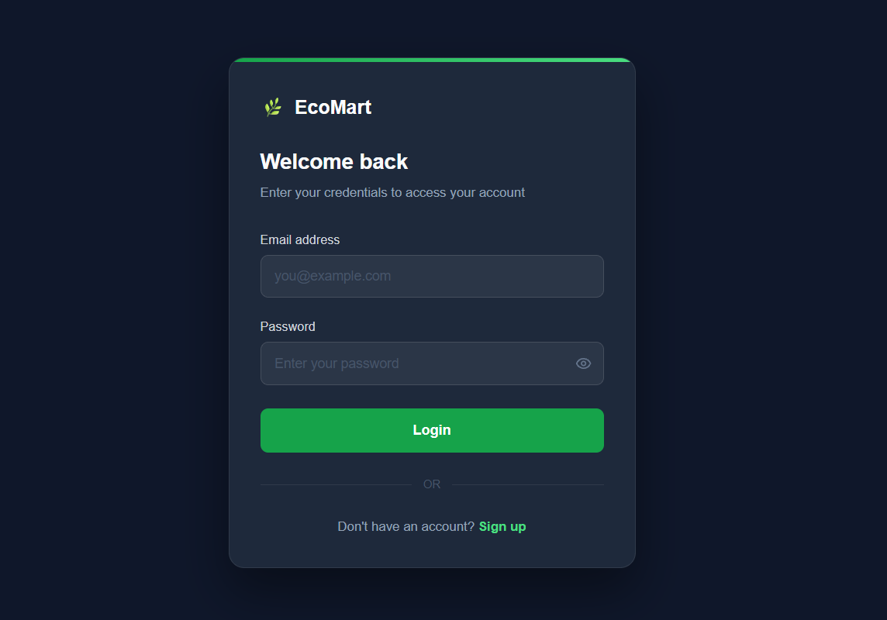

# 🛒 EcoMart - Full Stack E-Commerce Platform
<p align="center">
  <b>A Modern MERN Stack E-Commerce Platform with Razorpay Integration</b>
</p>
<p align="center">
  Built using React, Node.js, Express.js, MongoDB, Redux Toolkit, Cloudinary, and Razorpay.
</p>

---

## 📖 About The Project

EcoMart is a full-stack e-commerce platform that provides a complete online shopping experience for users and a powerful management dashboard for administrators.

Users can browse products, manage carts, save addresses, place orders, and make secure payments through Razorpay. Administrators can manage products, orders, users, and monitor sales through an analytics dashboard.

---

## 🚀 Tech Stack

| Frontend | Backend | Database | Services & Tools |
|-----------|----------|-----------|------------------|
| React.js | Node.js | MongoDB | Razorpay |
| Vite | Express.js | MongoDB Atlas | Cloudinary |
| Redux Toolkit | JWT Authentication | Mongoose | Multer |
| React Router | BcryptJS |  | CORS |
| Tailwind CSS | REST APIs |  | Git & GitHub |
| Shadcn UI | Middleware |  | Vercel |
| Axios | Role Based Access |  | Render |

---

# ✨ Features

| 👤 User Features | 👨‍💼 Admin Features |
|------------------|--------------------|
| User Registration & Login | Sales Dashboard |
| JWT Authentication | User Management |
| Browse Products | Product Management |
| Search & Filter Products | Add Products |
| Add to Cart | Edit Products |
| Address Management | Delete Products |
| Razorpay Payment Integration | Order Management |
| Order History | Order Tracking |
| Responsive Design | Business Analytics |

---

# 📸 Screenshots

## 🏠 Home & Authentication

<table>
  <tr>
    <td align="center"><b>🏠 Home Page</b><br/></td>
    <td align="center"><b>👤 User Authentication</b><br/></td>
  </tr>
</table>

---

## 👤 User Features

<table>
  <tr>
    <td align="center"><b>User Profile</b><br/></td>
    <td align="center"><b>Product Listing</b><br/></td>
  </tr>
  <tr>
    <td align="center"><b>Product Details</b><br/></td>
    <td align="center"><b>Add To Cart</b><br/></td>
  </tr>
  <tr>
    <td align="center"><b>Address Management</b><br/></td>
    <td align="center"><b>Razorpay Payment</b><br/></td>
  </tr>
</table>

---

## 👨‍💼 Admin Dashboard

<table>
  <tr>
    <td align="center"><b>📊 Sales Analytics Dashboard</b><br/></td>
    <td align="center"><b>👥 User Management</b><br/></td>
  </tr>
  <tr>
    <td align="center"><b>➕ Add Product</b><br/></td>
    <td align="center"><b>📦 Product Management</b><br/></td>
  </tr>
  <tr>
    <td align="center"><b>🚚 Order Management</b><br/></td>
    <td align="center"></td>
  </tr>
</table>

---

# 📂 Folder Structure

```bash
ecomart/
│
├── backend/
│   │
│   ├── config/
│   │   └── razorpay.js
│   │
│   ├── controllers/
│   │
│   ├── database/
│   │   └── db.js
│   │
│   ├── middleware/
│   │
│   ├── models/
│   │
│   ├── routes/
│   │
│   ├── utils/
│   │
│   ├── package.json
│   └── server.js
│
├── frontend/
│   │
│   ├── public/
│   │
│   ├── src/
│   │   ├── assets/
│   │   ├── components/
│   │   ├── pages/
│   │   ├── redux/
│   │   ├── lib/
│   │   ├── App.jsx
│   │   └── main.jsx
│   │
│   ├── package.json
│   ├── vite.config.js
│   └── tailwind.config.js
│
└── README.md
```

---

## 🚀 Running the Application

### Development Mode

**Terminal 1 - Backend:**
```bash
cd backend
npm start
```

**Terminal 2 - Frontend:**
```bash
cd frontend
npm run dev
```

Then open your browser and navigate to `http://localhost:5173`

### Production Mode

**Backend:**
```bash
cd backend
npm install
npm start
```

**Frontend:**
```bash
cd frontend
npm install
npm run build
npm run preview
```

---

**⭐ If you like this project, consider giving it a star!**
